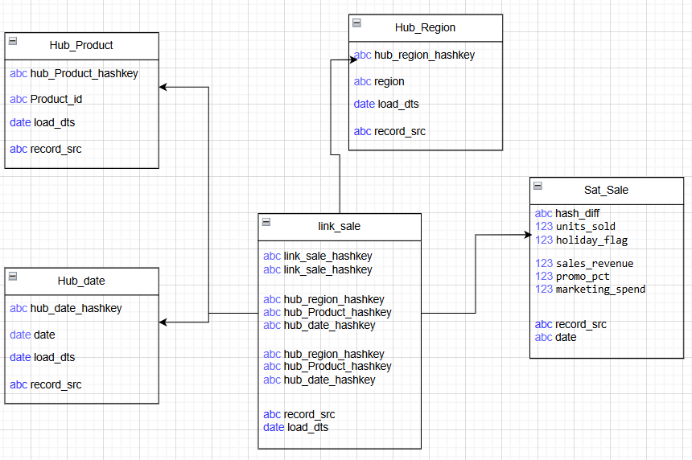
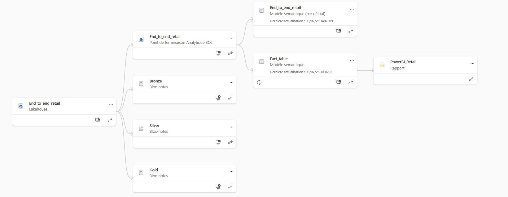
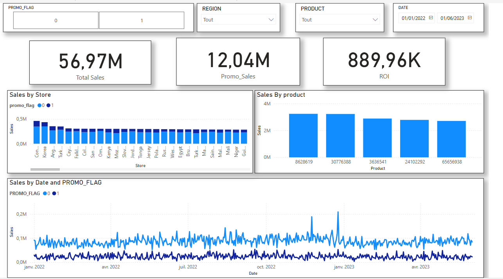

# Use Case – Retail Promotion Analytics avec Data Vault & Power BI

👤 Auteur : Etienne ZONON  
📅 Date : Juillet 2025  
🧰 Technologies : Microsoft Fabric (Lakehouse, Notebooks), Data Vault 2.0, Power BI, SQL, PySpark, Python

---

## Sommaire

- [1. Contexte](#1--contexte)
- [2. Données utilisées et aborescence](#2--données-utilisées-et-aborescence)
- [3. Modélisation Data Vault](#3--modélisation-data-vault)
  - [3.1 Hubs](#31--hubs)
  - [3.2 Links](#32--links)
  - [3.3 Satellites](#33--satellites)
- [4. Pipelines & Ingestion SQL](#4--pipelines--ingestion-sql)
- [5. Business Vault](#5--business-vault)
- [6. Vue analytique dans Power BI](#6--vue-analytique-dans-power-bi)
- [7. Cas d’usage & KPI créés](#7--cas-dusage--kpi-créés)
- [8. Prochaines étapes](#8--prochaines-étapes)

---

## 1. Contexte

Ce projet simule une analyse promotionnelle dans un contexte retail à l’aide d’une architecture moderne (Data Vault 2.0) hébergée sur Microsoft Fabric.  
Il permet de suivre les performances de ventes en lien avec les campagnes marketing et de construire des KPI fiables dans Power BI.

Après discussion avec le métier, il désire suivre l’impact des promotions sur les ventes hebdomadaires, régionales et produits.
Ensemble, il a été défini:

KPI demandés :
- CA total par semaine et région
- CA sous promo vs sans promo
- ROI marketing par semaine
- Top 5 produits promo

Filtrage :
- Par région
- Par produit
- Par période
- Par promo_flag (promo ou non)

---

## 2. Données utilisées et aborescence

Données provenant de Kaggle : données synthétiques sur les ventes par produit, store, date, avec colonnes suivantes :

# Description des colonnes de notre dataframe 


- Sales Revenue (USD): Total revenue generated from sales.
- Units Sold: Quantity of items sold.
- Discount Percentage: The percentage discount applied to products.
- Marketing Spend (USD): Budget allocated to marketing efforts.
- Store ID: Identifier for the retail store.
- Product Category: The category to which the product belongs (e.g., Electronics, Clothing).
- Date: The date when the sale occurred.
- Store Location: Geographic location of the store.
- Day of the Week: Day when the sale took place.
- Holiday Effect: Indicator of whether the sale happened during a holiday period

Chargées dans une table staging_sales sur Fabric Lakehouse.

# Aborescence du projet 


```text
retail-promo-bi/
│
├── end_to_end_lakehouse/
|   ├── README.md
|
|
|   ├── Table
│   ├── hub_product     /       <- Hub produit avec hash product_id
│   ├── hub_store       /       <- Hub store avec hash store_id
│   └── hub_date        /       <- Hub date avec hash date
│   ├── fact_sale_prom  /       <- Table de faits permettant de faire du Power BI
│   ├── link_sale       /       <- Link sale avec hash des différents hubs
│   └── sat_sale        /       <- Données descriptives des transactions
│
|   ├── File
│   ├── Retail_sales.csv/       <- Fichiers bruts (CSV)
|
├── notebooks/
│   ├── 01_Bronze.ipynb
│   ├── 02_Silver.ipynb
│   ├── 03_Gold.ipynb
│
├── docs/
│   ├── specs_fonctionnelles.md
│   └── schema_data_vault.drawio
│
├── requirements.txt
└── tests/
```


---

## 3. Modélisation Data Vault

Architecture Raw Vault 



### 3.1 Hubs

- Hub_Product (clé : product_id)  
- Hub_Store (clé : Store)  
- Hub_Date (clé : date)

### 3.2 Links

- Link_Sale (relation entre produit, store, date)

### 3.3 Satellites

- Sat_Sale (colonnes : units_sold, revenue, promo_pct, marketing_spend, holiday_flag)


> Clés générées par hash MD5, ingestion incrémentale, respect des bonnes pratiques.

Avantages :
- Historisation native (ex. : changement de prix ou profil client)
- Scalabilité et adaptation aux changements de structure
- Parfait pour les environnements multi-sources et cloud
  
Limites :
- Complexité élevée
- Nécessite une couche de transformation pour l’analyse BI

---

## 4. Pipelines & Ingestion SQL

Scripts SQL utilisés pour :

- Créer les Hubs, Links et Satellites  
- Générer les hashkeys  
- Insérer les données depuis la staging table

📁 Voir : ./notebook/silver.ipynb

Vous trouverez le Data lineage dans le schéma en dessous 


> Des tests de qualité sont réalisés sur la table finale : nulls, ROI négatif, doublons.

---

## 5. Business Vault

Création d’une table analytique fact_sales_promo :

- Base : vue PIT_Sale (via jointure Hubs + Link + Sat)  
- Table finale : matérialisée en Delta format (CREATE OR REPLACE TABLE ...)  
- Colonnes : product_id, Store, date, promo_flag, revenue, ROI, etc.

Cette table est exposée à Power BI via Direct Lake ou SQL Endpoint.

📁 Voir : ./notebook/gold.ipynb

---

## 6. Vue analytique dans Power BI

Visualisations créées :

- KPI : CA total, CA promo, ROI moyen  
- Graphique : top 5 produits en promotion (CA)  
- Carte : performances par store  
- Segments interactifs : période, produit, promo ou non

📁 Fichier Power BI : ./dashboard/report.pbix


---

## 7. Cas d’usage & KPI créés

- CA généré sous promotion  
- ROI promo = revenue / marketing -- Voir le notebook Gold  
- Répartition ventes promo vs non-promo  
- Analyse par Store, par période, par produit

📁 Les mesures DAX utilisées sont documentées dans : ./documents/measures.md

---

## 8. Prochaines étapes

- Ajouter une granularité hebdomadaire/mensuelle  
- Intégrer des données de marge (coûts)  
- Ajouter des prévisions (modèle ML simple)  
- Déployer le modèle avec un pipeline Fabric

---

© 2025 – Etienne ZONON | Fullstack Data Bilingue
